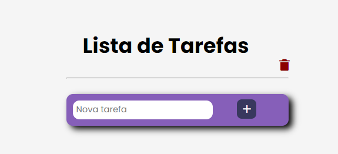
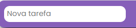
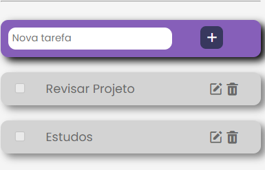
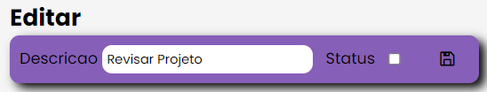
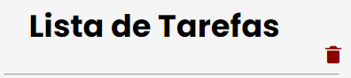

1. **Interface Inicial**

2. **Inclusão tarefa**

3.**Botão para inclusão** - Com tecla Enter, também será incluído.

4. **Tarefa Incluída**

5. **Editando uma tarefa**

6. **Botão para excluir todos os item**

**Processo de conexão de Banco, encontra-se na pasta Scripts/**

**Vídeo apresentação**

https://github.com/user-attachments/assets/3da16d3d-0072-41e2-9fd9-cc585f39c767

